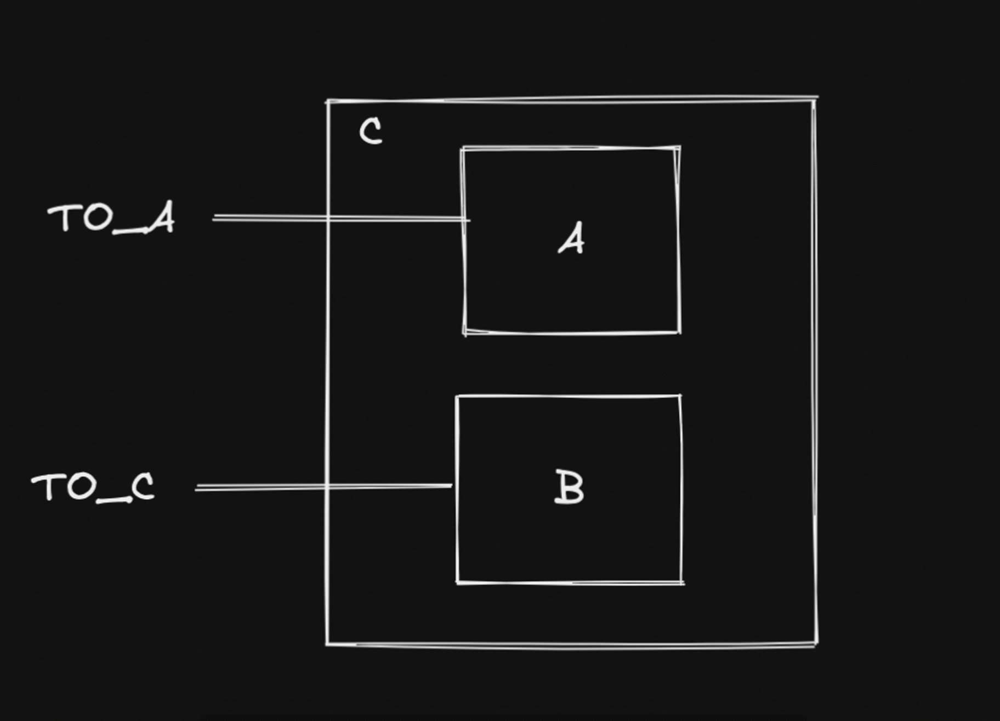

## Coupling statecharts to UI

There’s been conversations bubbling a way for a long time about how statecharts should relate to the UI:

> My belief is that the coupling of ui and statechart structures, hinders exploring different ways of modeling behaviour: introducing a parallel state, refining a state, etc. It introduces friction.
> [https://twitter.com/mogsie/status/1582816194058653696](https://twitter.com/mogsie/status/1582816194058653696)

The problem is that the possible set of behaviours, as governed by the active finite state, is directly related to the way we want to present the UI. The UI depends on the current state. We want to show buttons on the screen that can do something when clicked. We don’t show buttons that have no function in the current state, or if we do they are disabled.

We essentially want two things:

1. Encode the behaviours of the app - what should the app do?
2. Derive a UI from the current state - how should the app look?

The states that govern the behaviour of the app are extremely similar to /overlap with the states that are relevant to the UI. So there’s this inherent desire for the UI to want to reach into a machine and read it’s states directly. The problem is this creates a tight coupling to the structure of the machine.

My opinion as that there are two statecharts/groups of statecharts that should answer each question. They are very similar, but not the same. And it’s a mistake to use the same machine for both.

## Eventcharts

I’ve been continuing to work on eventcharts. Finite states, context (extended state) and actions are all pieces of the puzzle. Statecharts arrange these pieces in a particular fashion, but with eventcharts I’m exploring whether they might fit together in a different way.

<aside> 💡 Parts are the pieces that compose into an eventchart. I originally called them components but the confusion with UI components was overwhelming

</aside>

### Object context

I strongly believe that context needs to be globally readable, but this could still be achieved using objects with selectors. I started by defining a Part as a tuple `[schematic, selectors]`

```jsx
const HardModePart: Part = [
  ToggleSchematic,
  {
    hardMode: (state) => state.matches('on')
  }
]
```

`HardModePart` is an example of a _Primitive Part_. That is, unlike a _Composite Part_, it isn’t composed of other Parts.

The challenging part was deciding how to compose child selectors into the parent Part. I figured the simplest way was to merge them together, ignoring for now the possibility of selectors of the same name being defined in different parts of the tree.

```jsx
const PartA: Part = [
  SchematicA,
  {
    selectorA: (state) => state.matches('A')
  }
]

const PartB: Part = [
  SchematicB,
  {
    selectorB: (state) => state.matches('B')
  }
]

// PartC selectors = { selectorA, selectorB }
// createCompoundPart is a helper to auto merge selectors
// and construct a schematic based on the components and wiring provided
const PartC = createCompoundPart({
  id: 'core',
  components: [
    { id: 'partA', part: partA },
    { id: 'partB', part: partB }
  ],
  makeWires: (ctx, event) => ({
    in: {
      TO_A: { target: 'partA' },
      TO_B: { target: 'partB' }
    }
  })
})
```



The big limitation of merging selectors up the tree like this is that it’s easy to introduce circular definitions if unrelated subtrees want to access data from each other. Somehow, I just pointed everything to `AppPart` (the root of the Part tree) and it all magically worked, but I need to explore this further to see if it’s viable. It feels hacky, anyway.

Using objects makes it clear who ‘owns’ the data (especially write-access) and who can only read from it. But I’m unsure at this stage whether such strict write controls are viable, or if in practice they’ll need to be expanded to allow other Parts write-access.

### Global State

I had enough doubts about Object context approach that I immediately started on a global state approach. My mental model was basically eventcharts all wired up to a redux store.

When I say global state, I really am including all state, extended state as well as finite state. this is a marked difference from all the other statechart implementations I’ve seen which keep finite state stored locally in the object.

What’s about this difficult is that statecharts can update their state several times in response to a single external event - stateless transitions and self-targeted events are two examples. So if the finite states are being kept in an external store, they need to update immediately otherwise the statechart will get out of sync.

As an example, take the following statechart:

`START` transitions the finite state to `active`, which then sends itself `FINISH` and transitions back to `inactive`. If the finite states aren’t being updated immediately, `FINISH` will arrive when the state machine is in the wrong state.

The first approach I took to syncing finite state was to save the entire state value ( in the store. The steps when an event is received are:

1. Restore the machine using the saved state value
2. Apply the event to the machine
3. Save the updated machine as a state value back into the store

After I got this working, I had the thought that the store saving the exact state value is useful for the machine because it’s easy to restore it’s state, but it means that the UI has to do work mapping the state value to what it needs. Another approach would be to push the mapping into the machine. The datamodel stores a more ‘useful’ version of the data.

## Behaviour Trees vs FSMs

![[Pasted image 20230901200735.png]]
[https://twitter.com/gonnavis/status/1587166101951102977](https://twitter.com/gonnavis/status/1587166101951102977)

I’ve looked into behaviour trees (b-trees) before. They’re interesting because they are an alternative way to specify reactive behaviour, and as a result often get compared to FSMs and statecharts.

The great advantage of b-trees is that they are very composable and modular - it’s easy to add/remove subtrees without affecting other parts of the tree. Statecharts make this difficult because states can reference each other across all different parts of the tree.

B-trees are great for describing autonomous behaviour which is mostly a sequence of steps. They can struggle if you have lots of external inputs, because they don’t explicitly handle events like a statechart does. Instead, they have to infer something new has happened by checking a condition within the logic loop. For example, it knows it’s holding a ball by checking every time in the loop if there’s a ball. For a statechart, it’s easy to handle new inputs, just add another event handler.

I’d love to try implementing a UI with b-trees, although I don’t think it would be a great approach. B-trees are best for modelling sequences of actions with occasional checks to understand the external environment. UIs have loads of states and events, so what I suspect would happen is the tree would get filled with lots of conditions just trying to infer the current state of the UI.

There’s some similarities between b-trees and what I’m trying to do with eventcharts. Eventchart Parts are meant to be totally modular. They only define input/output events that can plug together with anything else of the same event type, and one Part can be implemented as a composite Part with lots of sub-Parts, without affecting the high-level interface.

## Misc thoughts

> It's interesting to me that function composition leads to generic leaves, gradually adding more context and specific functionality as you move to the root, while inheritance results in specialised leaves, refining the behaviour the further from the root you go
> https://twitter.com/fraser_drops/status/1582086862264377344](https://twitter.com/fraser_drops/status/1582086862264377344)

> Seeing the community churn from React Server Components and Next 13 reinforces my focus on ideas and techniques that aren't tied to any particular library, framework or programming language. statecharts, actors, live sequence charts, behaviour trees, b-threads, eventcharts
> [https://twitter.com/fraser_drops/status/1585311459160231936](https://twitter.com/fraser_drops/status/1585311459160231936)

> It feels like we're so far away from the spirit in the 70's and 80's of 'lets give the user some tools so they can build stuff'
> https://twitter.com/fraser_drops/status/1584643065226366977](https://twitter.com/fraser_drops/status/1584643065226366977)

## Links

[Convergence](https://queue.acm.org/detail.cfm?id=3546931&doi=10.1145%2F3546931) - Martin Kleppmann.

> Convergence is such a useful idea that different research communities have developed several ways of achieving it. This article looks at four variations on the theme of convergence, drawn from four areas of computer science.

[Everything is an X](https://lukeplant.me.uk/blog/posts/everything-is-an-x-pattern/) - Luke Plant

> “Everything is an X” is a very high level pattern that you see applied in the design of lots of systems, including programming languages and user interfaces. It has a lot of advantages, and some disadvantages. I'll discuss some of these, then look at some examples, which will be necessary to understand what I'm really talking about.
